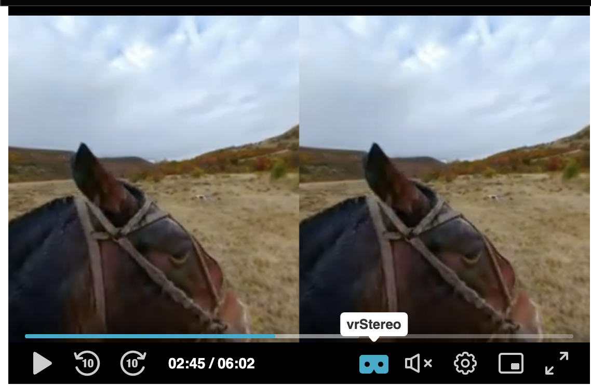

# PlayKit JS VR - VR plugin for the [PlayKit JS Player]

[](https://github.com/playkit-js-vr/actions/workflows/run_canary_full_flow.yaml)
[](https://github.com/prettier/prettier)
[](https://www.npmjs.com/package/@playkit-js/playkit-js-vr)
[](https://www.npmjs.com/package/@playkit-js/playkit-js-vr/v/canary)

PlayKit JS VR is written in [ECMAScript6], statically analysed using [Flow] and transpiled in ECMAScript5 using [Babel].

[flow]: https://flow.org/
[ecmascript6]: https://github.com/ericdouglas/ES6-Learning#articles--tutorials
[babel]: https://babeljs.io

## Getting Started

### Prerequisites

The plugin requires [PlayKit JS Player] to be loaded first.

[playkit js player]: https://github.com/kaltura/playkit-js

### Installing

First, clone and run [yarn] to install dependencies:

[yarn]: https://yarnpkg.com/lang/en/

```
git clone https://github.com/kaltura/playkit-js-vr.git
cd playkit-js-vr
yarn install
```

### Building

Then, build the player

```javascript
yarn run build
```

### Embed the library in your test page

Finally, add the bundle as a script tag in your page, and initialize the player

```html
<script type="text/javascript" src="/PATH/TO/FILE/playkit.js"></script>
<!--PlayKit player-->
<script type="text/javascript" src="/PATH/TO/FILE/playkit-vr.js"></script>
<!--PlayKit VR plugin-->
<div id="player-placeholder" style="height:360px; width:640px">
  <script type="text/javascript">
    var playerContainer = document.querySelector("#player-placeholder");
    var config = {
     ...
     plugins: {
       vr: {
         toggleStereo: true
       }
     }
     ...
    };
    var player = playkit.core.loadPlayer(config);
    playerContainer.appendChild(player.getView());
    player.play();
  </script>
</div>
```

## Documentation

The Kaltura Player supports 360° video in both desktop and mobile device for any kind of motion: mouse, touch, device motion and keyboard keys.

This plugin is depended on [three.js](https://github.com/mrdoob/three.js) library.

The player will be informed that it deals with 360/VR media by populating attributes in the `sources` object which is part of the kaltura player config 
it might be populted using providers or the app itself) 

* metadata object must contain `"tags": "360"` and `"vr": {}` object which is not null.

in case app is using setMedia instead of load media `tags and vr` for 360 plyback these attribues are expected to be populated by app

#### Media Sources Example 

```
{
  "sources": {
    "options": {},
    "metadata": {
      "tags": "360"
    },
    "hls": [...],
    "dash": ...],
    "id": "",
    "duration": 362,
    "type": "Vod",
    "poster": "",
    "dvr": false,
    "vr": {},
    "captions": []
  }
}
```


##### The 360/VR plugin exposes some attribures from plugin configurations:

* Player will load on stereo mode 

* Enable toggle vr/stereo mode button.



* Change the sensitivity of the touch motion using moveMultiplier attribute.
by default is ```0.15```. 

* Change the sensitivity the device motion itself, using deviceMotionMultiplier attribute.
by default is ```1```. 

* Change the camera options - The projection mode is designed to mimic the way the human eye sees. 
It is the most common projection mode used for rendering a 3D scene.
[CameraOptions](https://threejs.org/docs/#api/en/cameras/PerspectiveCamera)

```
plugins: {
...
"vr": { 
      "startInStereo": false,     
      "toggleStereo": false,     
      "moveMultiplier": 0.15,
      "deviceMotionMultiplier": 1,
      "cameraOptions": {
        "fov": 75,
        "aspect": 1.777, // (width/height)
        "near": 0.1,
        "far": 1000
      },
    },
}    
```    

##### VR Plugin Player Event
* `VR_STEREO_MODE_CHANGED` - this event will be fired once user click on the vr icon and changes the playback state from `VR` to `STEREO` mode.

##### VR Plugin Player Error code
* `VR_NOT_SUPPORTED` - this event will be fired once the device used for 360/VR playback does not support this mode.


**[Configuration](docs/configuration.md)**

* In the following example you can change the plugin attributes and get the feeling what each attribute does.

**[VR Plugin Example](https://codepen.io/giladna/pen/abYgjxY)**

## Running the tests

Tests can be run locally via [Karma], which will run on Chrome, Firefox and Safari

[karma]: https://karma-runner.github.io/1.0/index.html

```
yarn run test
```

You can test individual browsers:

```
yarn run test:chrome
yarn run test:firefox
yarn run test:safari
```

### And coding style tests

We use ESLint [recommended set](http://eslint.org/docs/rules/) with some additions for enforcing [Flow] types and other rules.

See [ESLint config](.eslintrc.json) for full configuration.

We also use [.editorconfig](.editorconfig) to maintain consistent coding styles and settings, please make sure you comply with the styling.

## Compatibility

TBD

## Contributing

Please read [CONTRIBUTING.md](https://gist.github.com/PurpleBooth/b24679402957c63ec426) for details on our code of conduct, and the process for submitting pull requests to us.

## Versioning

We use [SemVer](http://semver.org/) for versioning. For the versions available, see the [tags on this repository](https://github.com/kaltura/playkit-js-vr/tags).

## License

This project is licensed under the AGPL-3.0 License - see the [LICENSE.md](LICENSE.md) file for details
